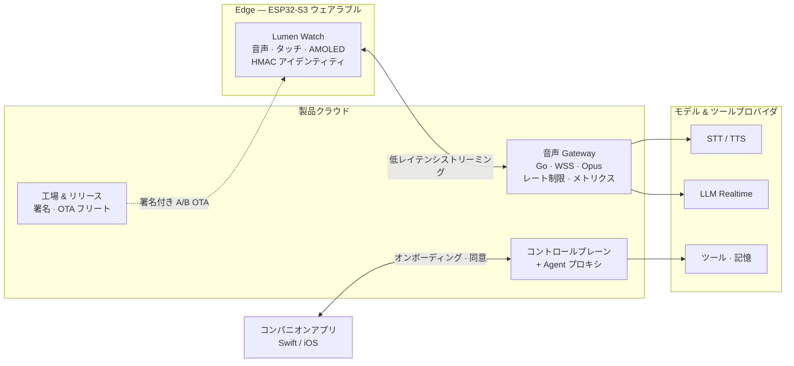

<div align="center">


# LUMEN AGENT WATCH · Platform

**ESP32-S3 ベースのウェアラブル AI エージェント — 自然な音声、オンデバイス Agent ランタイム、製品グレードのクラウド。**

XiaoZhi の実績ある音声スタック × ESP-Claw のオンデバイス Agent ランタイムを、
製品独自の ESP-IDF アプリケーションシェルとして再構築。

[](https://jiapunk.github.io/lumen-watch-site/)
[](#ハードウェアターゲット)
[](#クイックスタート)
[](#ハイライト)
[](#クイックスタート)
[](#リポジトリ構成)
[](#ロードマップ)

[English](README.md) · [繁體中文](README.zh-TW.md) · [**日本語**](README.ja.md)

[デモサイト](https://github.com/jiapunk/lumen-watch-site) · [プロダクト blueprint](https://github.com/jiapunk/xiaozhi-esp-claw-blueprint) · [エンジニアリングログ](docs/ENGINEERING_LOG.md)

</div>

---

## このプロジェクトについて

**Lumen Agent Watch** は ESP32-S3 ベースのスマートウォッチ型 AI エージェント端末です。
自然な音声対話、リアルタイム情報検索、デバイス制御、パーソナルな長期記憶を腕上で実現します。
本リポジトリはその完全なプロダクトプラットフォームです。

- **ファームウェア**：製品独自の ESP-IDF アプリフレームワーク。XiaoZhi（xiaozhi-esp32）の
  ウェイクワード・オーディオ・Codec・ボードモジュールを選択的に再利用し、ESP-Claw を
  オンデバイス Agent ランタイムとして採用。両者は自社開発の `agent_bridge` 統合レイヤーで接続。
- **バックエンド**：Go 製音声 Gateway（WSS + Opus、デバイス認証、STT/TTS アダプタ、
  レート制限・メトリクス）、コントロールプレーン、Agent プロキシ、工場／リリースツールチェーン。
- **周辺**：Swift 製コンパニオンアプリ、工場・サプライチェーン schema、豊富なホストテストと
  リリースゲート。

> 製品設計の詳細は [プロダクト blueprint](https://github.com/jiapunk/xiaozhi-esp-claw-blueprint)、
> 操作できる紹介サイトは [lumen-watch-site](https://github.com/jiapunk/lumen-watch-site) をご覧ください。

## なぜ作ったのか

一般的な音声アシスタントは質問に答えるだけ。**Lumen は「行動する」ために設計されています** —
ウェブ検索、デバイス調整、写真撮影、接続管理。機密性の高い操作は、実行前に必ず腕上で
確認されます。ウォッチは軽量で静かに保ち、重い処理はリージョン Gateway が担当。
工場プロビジョニング、署名付き A/B OTA、フリート制御、失効、リセットと再販売まで、
実製品のライフサイクル全体を engineering の対象にしました。

## アーキテクチャ



**デバイス側の接合点** — XiaoZhi の `type: "stt"` コールバックが `device_voice_runtime` から
`xiaozhi_agent_adapter` へ渡され、コントローラが直列化された `agent_bridge` ステートマシンを
駆動します。Agent の結果は有界イベントキューを経て、リクエスト相関付きの
`tts_request` / `tts_abort` メッセージへ。割り込み（barge-in）時は古い音声をキャンセルし、
順序不正の結果を拒否します。

## ハイライト

- **再現可能な upstream** — ピン留めロックファイル + ダウンローダ。 upstream プロジェクトの
  書き換えは行いません。
- **アロケーションフリー・リクエスト相関の `agent_bridge`** — 成功・失敗・割り込み・
  期限切れイベント・request-id 周回の各パスをホストテストでカバー。
- **製品級の音声プロトコル** — fail-closed な Device Agent v1 ネゴシエーション、
  Opus パケット単位の厳格検証（60 ms / 16 kHz STT、24 kHz TTS）、バッファ枯渇や
  不正 ID のテスト。
- **Go Gateway** — デバイス認証、プライベート STT/TTS アダプタ、実ソケット統合テスト、
  レート制限、メトリクス、グレースフルシャットダウン。
- **決定論的な Codec 検証** — libopus エンコードのフィクスチャを、ハッシュピン留めした
  FFmpeg デコーダで検証。
- **製品ライフサイクル工学** — 32 MB A/B OTA パーティション、署名付き OTA バンドル、
  フリートロールアウト、イミュータブルなファームウェアオリジン、工場アイデンティティ、
  認証情報ライフサイクル、デバイス失効、停電セーフなリセット — すべて自動リリースゲート付き。
- **プライバシー・バイ・デザイン** — コンテンツフリーなオブザーバビリティ（閉じた単調
  カウンタのみ）、有界な Agent メモリ、引数バインドの 30 秒腕上同意。

## ハードウェアターゲット

| 役割 | ボード | 状態 |
|---|---|---|
| 統合 / bring-up | ESP32-S3-BOX-3 N16R8 | ✅ 主要開発ターゲット |
| 長期製品ベースライン | ESP32-S3-WROOM-2-N32R16V（32MB Flash / 16MB PSRAM） | 🎯 量産ハードウェアリファレンス |
| カメラ bring-up | ブレッドボード ESP32-S3 + カメラ | 🧪 実験的 |
| ウォッチフォームファクタ | Waveshare ESP32-S3 Touch AMOLED | 🧪 bring-up |

> ESP-Claw の公式最低要件は 8MB Flash + 8MB PSRAM。製品はデュアル OTA・音声アセット・
> スキル・永続メモリを追加するため、カスタムハードウェアは 32/16MB を採用します。

## リポジトリ構成

| パス | 内容 |
|---|---|
| `main/` `components/` | ESP-IDF 製品ファームウェア（アプリシェル、`agent_bridge`、音声ランタイム） |
| `gateway/` | Go 製音声 Gateway、コントロールプレーンサービス、schema |
| `companion-app/` | Swift パッケージ — iOS コンパニオンコア + テスト |
| `factory/` | プロビジョニング schema と適合性テスト |
| `release/` `firmware/` `ota/` | リリースエビデンス、SBOM ポリシー、OTA manifest schema |
| `deployment/` | Kubernetes デプロイプロファイルとリージョン別デプロイガイド |
| `tools/` | ビルド・適合性・リリースゲートスクリプト（Python / shell） |
| `tests/host/` | ホストビルド可能な C テスト（ブリッジ／ランタイム／プロトコル全体） |
| `patches/` | ダイジェストロック済み upstream パッチ（例：コンテンツフリー privacy パッチ） |
| `docs/ENGINEERING_LOG.md` | マイルストーンごとの完全なエンジニアリングログ（M0 → M88） |

## クイックスタート

**要件** — ESP-IDF 6.0.2（ファームウェア）、Go 1.26.5（Gateway／テスト）、
Python 3.11 と TLS 1.3 対応 OpenSSL + `cryptography`（ツール／ゲート用）。

```sh
# 1. ピン留め済み upstream を同期（xiaozhi-esp32、esp-claw）
./tools/sync_upstreams.sh

# 2. ファームウェアをビルド
./tools/build_generic.sh            # 汎用ベースライン
./tools/build_box3.sh               # ESP32-S3-BOX-3 N16R8

# 3. ホスト検証スイート全体を実行（C + Python + Go）
./tools/run_all_tests.sh
```

live-composition および production-security ビルドゲートは、使い捨てテスト鍵のみで
オプトイン構成をコンパイルします — 出力は意図的に未署名であり、フラッシュや出荷は
禁止です。リリース署名とロールアウト手順はプロダクト runbook（ローカル管理・非公開）にあります。

## ロードマップ

エンジニアリングは **M0 → M88** の検証済みゲートを通過して進みました。

| フェーズ | マイルストーン | スコープ |
|---|---|---|
| 基盤 | M0–M4 | ビルドベースライン、音声プロトコル、オーディオストリーミング、セキュアデバイス統合 |
| アイデンティティ & 接続 | M5–M12 | 認証情報ライフサイクル、工場アイデンティティ、コントロールプレーン、メモリ予算、Wi-Fi ライフサイクル、セキュアプロビジョニング |
| ストレージ & OTA | M13–M20 | 製品ストレージ、署名付き A/B OTA、フリート制御、イミュータブルオリジン、OCI サプライチェーン |
| Agent 製品サーフェス | M21–M28 | 有界メモリ、ランタイムオーケストレーション、物理アクション、ブートセキュリティ、音声プロバイダ適合、リファレンス Codec |
| 所有権 & 同意 | M29–M47 | アイデンティティ失効、所有権クレーム／リカバリ、ケイパビリティファイアウォール、コンテンツフリー計測、正確なアクション同意 |
| リリースインフラ | M48–M63 | OCI リリース、署名付き Kubernetes デプロイ／admission、SKU ガード、工場マニフェスト、eFuse ライフサイクル、トラステッドタイム |
| コンパニオン & 配信 | M64–M72 | 可視 Agent アクション、JIT 同意、wake-only 通知、プッシュ配信、署名付き App、mTLS ディスパッチ |
| 運用 & スケール | M73–M88 | マネージド DB 耐障害性、分散协调、ワークロードアイデンティティ、鍵ローテーション、SLO、使用量予算、サービスエンタイトルメント、上市レーン |

各ゲートの詳細：[`docs/ENGINEERING_LOG.md`](docs/ENGINEERING_LOG.md)。

## ドキュメント

このスナップショットに含まれる技術リファレンス：

- [`VOICE_AGENT_PROTOCOL.md`](VOICE_AGENT_PROTOCOL.md) — デバイスと Gateway のワイヤプロトコル
- [`XIAOZHI_INTEGRATION.md`](XIAOZHI_INTEGRATION.md) — ピン留め upstream のフックポイント
- [`PRODUCT_SKU_PORTING_GUIDE.md`](PRODUCT_SKU_PORTING_GUIDE.md) — 新ハードウェア SKU への移植ガイド
- [`WATCH_BASELINE_2026-09-05.md`](WATCH_BASELINE_2026-09-05.md) · [`VOICE_CORE_REBUILD_2026-09-05.md`](VOICE_CORE_REBUILD_2026-09-05.md) — 現在のウォッチ & 音声コアベースライン
- [`THIRD_PARTY_NOTICES.md`](THIRD_PARTY_NOTICES.md) — upstream ライセンス
- その他：bring-up ノート、メモリ予算、Wi-Fi ライフサイクル、プロトコル & Codec レポート（リポジトリルート）

> **スコープについて** — セキュリティ・プライバシー・工場プロセスの runbook、
> デバイス固有アーティファクト、秘密情報は意図的に本リポジトリには公開していません。

## 関連リポジトリ

- 📘 [xiaozhi-esp-claw-blueprint](https://github.com/jiapunk/xiaozhi-esp-claw-blueprint) — 本プラットフォームが実装するプロダクト blueprint
- 🌐 [lumen-watch-site](https://github.com/jiapunk/lumen-watch-site) — インタラクティブな製品紹介サイト

## 謝辞

2 つの優れたオープンソースプロジェクトの上に成り立っています：

- [xiaozhi-esp32](https://github.com/78/xiaozhi-esp32) — 音声インタラクションスタック（MIT）
- [ESP-Claw](https://github.com/espressif/esp-claw) — オンデバイス Agent ランタイム（Apache-2.0）

upstream のリビジョンは `upstream.lock.json` にピン留めされています。
