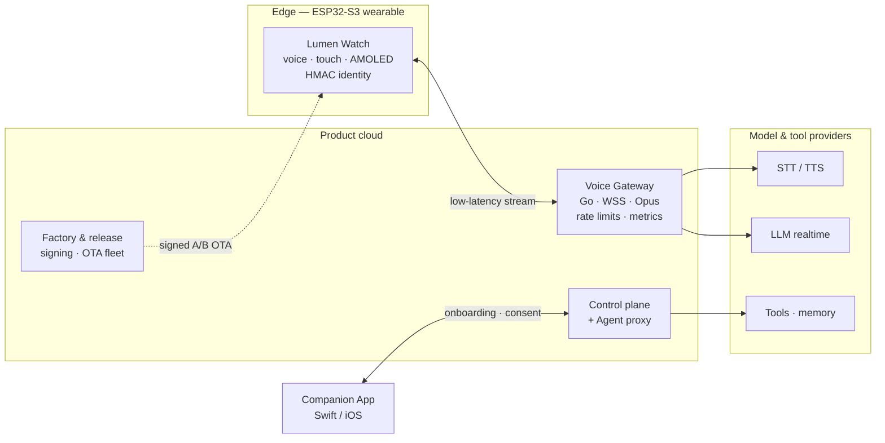

<div align="center">

# LUMEN AGENT WATCH · Platform

**An ESP32-S3 wearable AI agent — natural voice, on-device agent runtime, product-grade cloud.**

XiaoZhi's proven voice stack × ESP-Claw's on-device agent runtime, rebuilt behind a
product-owned ESP-IDF application shell.

[](#hardware-targets)
[](#quick-start)
[](#highlights)
[](#quick-start)
[](#repository-layout)
[](#roadmap)

[體驗網站](https://github.com/jiapunk/lumen-watch-site) · [產品藍圖](https://github.com/jiapunk/xiaozhi-esp-claw-blueprint) · [工程日誌](docs/ENGINEERING_LOG.md)

</div>

---

## 中文簡介

**Lumen Agent Watch** 是一款以 ESP32-S3 為基礎的智慧手錶型 AI Agent 裝置：手上自然對話、
即時查詢、裝置控制與個人長期記憶。本 repo 是它的完整產品平台：

- **韌體**：自有 ESP-IDF 應用框架，選擇性重用小智（xiaozhi-esp32）的喚醒、音訊、Codec 與板級模組，
  並以 ESP-Claw 作為裝置端 Agent Runtime，兩者透過自研 `agent_bridge` 整合層連接。
- **後端**：Go 語音 Gateway（WSS + Opus、裝置認證、STT/TTS adapter、限流與指標）、
  control plane、Agent proxy 與工廠／釋出工具鏈。
- **配套**：Swift Companion App、工廠與供應鏈 schema、大量 host 級測試與 release gate。

> 完整產品設計理念見 [產品藍圖 repo](https://github.com/jiapunk/xiaozhi-esp-claw-blueprint)，
> 可操作的介紹網站見 [lumen-watch-site](https://github.com/jiapunk/lumen-watch-site)。

---

## Why this exists

Consumer voice assistants answer questions. **Lumen is designed to act** — query the web,
adjust the device, capture a photo, manage connections — with sensitive actions confirmed
on-wrist before anything happens. The watch stays light and quiet; regional gateways do the
heavy lifting; the whole stack is engineered for a real product lifecycle (factory
provisioning, signed A/B OTA, fleet control, revocation, reset & resale).

## Architecture



**On-device seam** — XiaoZhi's `type: "stt"` callback feeds `device_voice_runtime` through
`xiaozhi_agent_adapter`; the controller drives the serialized `agent_bridge` state machine;
agent results return through a bounded event queue into request-correlated
`tts_request` / `tts_abort` wire messages. Barge-in cancels stale audio and rejects
out-of-order results.

## Highlights

- **Reproducible upstreams** — pinned lock file + downloader; no ground-up rewrite of either upstream project.
- **Allocation-free request-correlated `agent_bridge`** with host tests for success, failure, interruption, stale-event and request-id wraparound paths.
- **Product voice protocol** — fail-closed Device Agent v1 negotiation, strict per-packet Opus validation (60 ms / 16 kHz STT, 24 kHz TTS), buffer-exhaustion and malformed-ID coverage.
- **Go gateway** — device authentication, private STT/TTS adapters, real-socket integration tests, rate limits, metrics, graceful shutdown.
- **Deterministic codec qualification** — libopus-encoded fixtures verified by a hash-pinned FFmpeg decoder.
- **Production lifecycle engineering** — 32 MB A/B OTA partitioning, signed OTA bundles, fleet rollout generation, immutable firmware origin, factory identity, credential lifecycle, device revocation, power-loss-safe reset — each behind an automated release gate.
- **Privacy by construction** — content-free observability (closed monotonic counters only), bounded agent memory, argument-bound consent with 30-second on-wrist confirmation.

## Hardware targets

| Role | Board | Status |
|---|---|---|
| Integration / bring-up | ESP32-S3-BOX-3 N16R8 | ✅ primary development target |
| Long-term product baseline | ESP32-S3-WROOM-2-N32R16V (32 MB flash / 16 MB PSRAM) | 🎯 production hardware reference |
| Camera bring-up | Breadboard ESP32-S3 + camera | 🧪 experimental |
| Watch form factor | Waveshare ESP32-S3 Touch AMOLED watch | 🧪 bring-up |

> ESP-Claw's documented minimum is 8 MB flash + 8 MB PSRAM; the product adds dual OTA,
> voice assets, skills and persistent memory — hence 32/16 MB for custom hardware.

## Repository layout

| Path | What it is |
|---|---|
| `main/` `components/` | ESP-IDF product firmware (application shell, `agent_bridge`, voice runtime) |
| `gateway/` | Go voice gateway, control-plane services, schemas |
| `companion-app/` | Swift package — iOS companion core + tests |
| `factory/` | Provisioning schemas & qualification tests |
| `release/` `firmware/` `ota/` | Release evidence, SBOM policy and OTA manifest schemas |
| `deployment/` | Kubernetes deployment profiles & regional deployment guides |
| `tools/` | Build, qualification and release-gate scripts (Python / shell) |
| `tests/host/` | Host-buildable C tests for the entire bridge/runtime/protocol surface |
| `patches/` | Digest-locked upstream patches (e.g. content-free privacy patch) |
| `docs/ENGINEERING_LOG.md` | Full milestone-by-milestone engineering log (M0 → M88) |

## Quick start

**Requirements** — ESP-IDF 6.0.2 (firmware), Go 1.26.5 (gateway/tests), Python 3.11 with a
TLS 1.3-capable OpenSSL and `cryptography` (tooling/gates).

```sh
# 1. sync pinned upstreams (xiaozhi-esp32, esp-claw)
./tools/sync_upstreams.sh

# 2. build firmware
./tools/build_generic.sh            # generic baseline
./tools/build_box3.sh               # ESP32-S3-BOX-3 N16R8

# 3. run the full host verification suite (C + Python + Go)
./tools/run_all_tests.sh
```

The live-composition and production-security build gates compile opt-in profiles with
disposable test keys only — their outputs are deliberately unsigned and must never be
flashed or shipped. Release signing and rollout procedures live in the product runbooks
(local, not published).

## Roadmap

Engineering advanced through **M0 → M88** verified gates. The journey in phases:

| Phase | Milestones | Scope |
|---|---|---|
| Foundation | M0–M4 | Build baseline, voice protocol, audio streaming, secure device integration |
| Identity & connectivity | M5–M12 | Credential lifecycle, factory identity, control plane, memory budget, Wi-Fi lifecycle, secure provisioning |
| Storage & OTA | M13–M20 | Production storage, signed A/B OTA, fleet control, immutable origin, OCI supply chain |
| Agent product surface | M21–M28 | Bounded memory, runtime orchestration, physical actions, boot security, speech conformance, reference codec |
| Ownership & consent | M29–M47 | Identity revocation, ownership claim/recovery, capability firewall, content-private observability, exact-action consent |
| Release infrastructure | M48–M63 | OCI release, signed Kubernetes deploy/admission, SKU guard, factory manifests, eFuse lifecycle, trusted time |
| Companion & delivery | M64–M72 | Visible agent actions, JIT consent, wake-only notifications, push delivery, signed app delivery, mTLS dispatch |
| Operate & scale | M73–M88 | Managed DB resilience, distributed coordination, workload identity, key rotation, SLOs, usage budgets, entitlements, launch lanes |

Full detail for every gate: [`docs/ENGINEERING_LOG.md`](docs/ENGINEERING_LOG.md).

## Documentation

Technical references included in this snapshot:

- [`VOICE_AGENT_PROTOCOL.md`](VOICE_AGENT_PROTOCOL.md) — wire protocol between device and gateway
- [`XIAOZHI_INTEGRATION.md`](XIAOZHI_INTEGRATION.md) — pinned upstream hook points
- [`PRODUCT_SKU_PORTING_GUIDE.md`](PRODUCT_SKU_PORTING_GUIDE.md) — porting to new hardware SKUs
- [`WATCH_BASELINE_2026-09-05.md`](WATCH_BASELINE_2026-09-05.md) · [`VOICE_CORE_REBUILD_2026-09-05.md`](VOICE_CORE_REBUILD_2026-09-05.md) — current watch & voice-core baselines
- [`THIRD_PARTY_NOTICES.md`](THIRD_PARTY_NOTICES.md) — upstream licenses
- more: bring-up notes, memory budget, Wi-Fi lifecycle, protocol & codec reports (see repo root)

> **Note on scope** — security, privacy and factory-process runbooks, device-specific
> artifacts and secrets are intentionally **not published** in this repository.

## Related repositories

- 📘 [xiaozhi-esp-claw-blueprint](https://github.com/jiapunk/xiaozhi-esp-claw-blueprint) — the product blueprint this platform implements
- 🌐 [lumen-watch-site](https://github.com/jiapunk/lumen-watch-site) — interactive product introduction site

## Acknowledgements

Built on the shoulders of two excellent open-source projects:

- [xiaozhi-esp32](https://github.com/78/xiaozhi-esp32) — voice interaction stack (MIT)
- [ESP-Claw](https://github.com/espressif/esp-claw) — on-device agent runtime (Apache-2.0)

Upstream revisions are pinned in `upstream.lock.json`.
