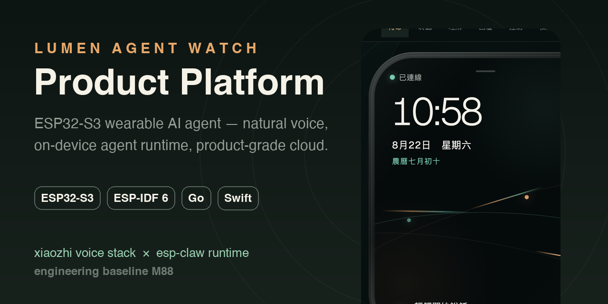
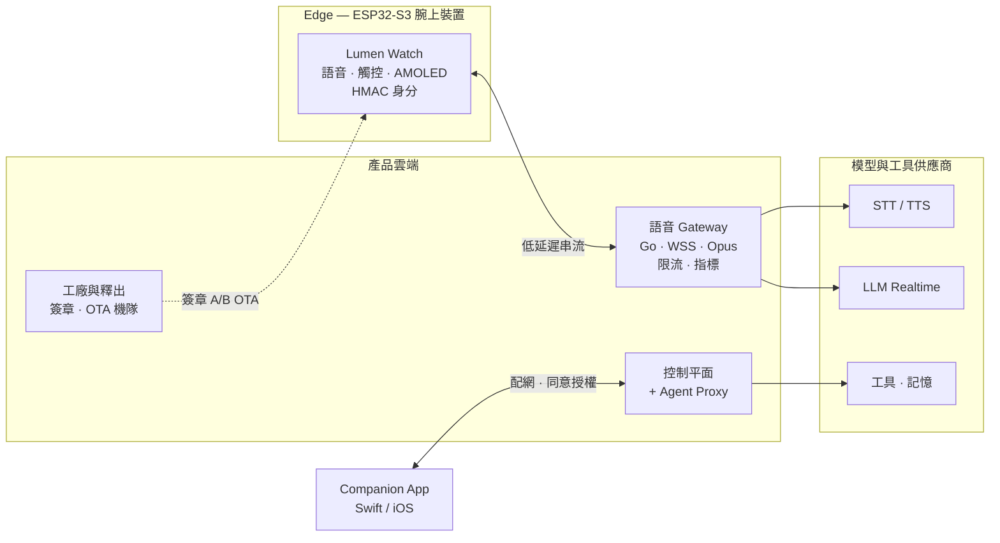

<div align="center">



# LUMEN AGENT WATCH · 產品平台

**以 ESP32-S3 為基礎的腕上 AI Agent —— 自然語音、裝置端 Agent Runtime、產品級雲端。**

小智（XiaoZhi）成熟語音堆疊 × ESP-Claw 裝置端 Agent Runtime，
重建於產品自有的 ESP-IDF 應用框架之中。

[](https://jiapunk.github.io/lumen-watch-site/)
[](#硬體目標)
[](#快速開始)
[](#核心亮點)
[](#快速開始)
[](#目錄結構)
[](#路線圖)

[English](README.md) · [**繁體中文**](README.zh-TW.md) · [日本語](README.ja.md)

[互動網站](https://github.com/jiapunk/lumen-watch-site) · [產品藍圖](https://github.com/jiapunk/xiaozhi-esp-claw-blueprint) · [工程日誌](docs/ENGINEERING_LOG.md)

</div>

---

## 這個專案是什麼

**Lumen Agent Watch** 是一款以 ESP32-S3 為基礎的智慧手錶型 AI Agent 裝置：手上自然對話、
即時查詢、裝置控制與個人長期記憶。本 repo 是它的完整產品平台：

- **韌體**：自有 ESP-IDF 應用框架，選擇性重用小智（xiaozhi-esp32）的喚醒、音訊、Codec 與板級模組，
  並以 ESP-Claw 作為裝置端 Agent Runtime，兩者透過自研 `agent_bridge` 整合層連接。
- **後端**：Go 語音 Gateway（WSS + Opus、裝置認證、STT/TTS adapter、限流與指標）、
  control plane、Agent proxy 與工廠／釋出工具鏈。
- **配套**：Swift Companion App、工廠與供應鏈 schema、大量 host 級測試與 release gate。

> 完整產品設計理念見 [產品藍圖 repo](https://github.com/jiapunk/xiaozhi-esp-claw-blueprint)，
> 可操作的介紹網站見 [lumen-watch-site](https://github.com/jiapunk/lumen-watch-site)。

## 為什麼做這個

一般語音助理只會回答問題。**Lumen 的設計目標是「行動」**—— 查詢網路、調整裝置、拍照、
管理連線，敏感操作都會先在錶上二次核准才執行。手錶保持輕巧安靜；區域 Gateway 承擔
重運算；整條技術棧以真實產品生命週期為標準打造（工廠配發、簽章 A/B OTA、機隊控制、
撤銷、重置與轉售）。

## 系統架構



**裝置端縫合點** —— 小智的 `type: "stt"` 回呼經 `device_voice_runtime` 進入
`xiaozhi_agent_adapter`；控制器驅動序列化的 `agent_bridge` 狀態機；Agent 結果經
有界事件佇列回到具請求關聯的 `tts_request` / `tts_abort` 訊息。打斷（barge-in）
會取消過期音訊並拒絕亂序結果。

## 核心亮點

- **可重現的 upstream** — 釘選版鎖定檔 + 下載器；不重寫任何上游專案。
- **零配置、請求關聯的 `agent_bridge`** — host 測試覆蓋成功、失敗、打斷、過期事件與
  request-id 迴繞路徑。
- **產品級語音協議** — fail-closed 的 Device Agent v1 協商、逐封包嚴格 Opus 驗證
  （60 ms / 16 kHz STT、24 kHz TTS）、緩衝區耗盡與 malformed-ID 測試。
- **Go Gateway** — 裝置認證、私有 STT/TTS adapter、真實 socket 整合測試、限流、指標、優雅關機。
- **確定性 Codec 驗證** — libopus 編碼 fixtures，以 hash 釘選的 FFmpeg 解碼器驗證。
- **產品生命週期工程** — 32 MB A/B OTA 分區、簽章 OTA bundle、機隊 rollout、不可變韌體來源、
  工廠身分、憑證生命週期、裝置撤銷、斷電安全重置 —— 全部有自動化 release gate。
- **隱私內建** — 無內容可觀測性（僅封閉單調計數器）、有界 Agent 記憶、參數綁定的
  30 秒腕上同意確認。

## 硬體目標

| 角色 | 開發板 | 狀態 |
|---|---|---|
| 整合 / bring-up | ESP32-S3-BOX-3 N16R8 | ✅ 主要開發目標 |
| 長期產品基準 | ESP32-S3-WROOM-2-N32R16V（32MB Flash / 16MB PSRAM） | 🎯 量產硬體參考 |
| 攝影機 bring-up | 麵包板 ESP32-S3 + camera | 🧪 實驗性 |
| 手錶形態 | Waveshare ESP32-S3 Touch AMOLED 錶 | 🧪 bring-up |

> ESP-Claw 官方最低需求為 8MB Flash + 8MB PSRAM；產品還需雙 OTA、語音資產、技能與
> 持久記憶 —— 因此自訂硬體採 32/16MB。

## 目錄結構

| 路徑 | 內容 |
|---|---|
| `main/` `components/` | ESP-IDF 產品韌體（應用框架、`agent_bridge`、語音 runtime） |
| `gateway/` | Go 語音 Gateway、控制平面服務、schema |
| `companion-app/` | Swift package — iOS Companion 核心 + 測試 |
| `factory/` | 配發 schema 與資格測試 |
| `release/` `firmware/` `ota/` | 釋出證據、SBOM 政策與 OTA manifest schema |
| `deployment/` | Kubernetes 部署設定與區域部署指南 |
| `tools/` | 建置、資格驗證與 release gate 腳本（Python / shell） |
| `tests/host/` | 可在 host 建置的 C 測試（橋接／runtime／協議全覆蓋） |
| `patches/` | 經 digest 鎖定的 upstream 補丁（例如無內容隱私補丁） |
| `docs/ENGINEERING_LOG.md` | 完整里程碑工程日誌（M0 → M88） |

## 快速開始

**需求** — ESP-IDF 6.0.2（韌體）、Go 1.26.5（Gateway／測試）、Python 3.11（含支援
TLS 1.3 的 OpenSSL 與 `cryptography`，工具鏈／gate 用）。

```sh
# 1. 同步釘選的 upstream（xiaozhi-esp32、esp-claw）
./tools/sync_upstreams.sh

# 2. 建置韌體
./tools/build_generic.sh            # 通用基線
./tools/build_box3.sh               # ESP32-S3-BOX-3 N16R8

# 3. 執行完整 host 驗證（C + Python + Go）
./tools/run_all_tests.sh
```

live-composition 與 production-security 建置 gate 僅用拋棄式測試金鑰編譯 opt-in 設定 ——
其產出刻意未簽章，絕不可燒錄或出貨。釋出簽章與 rollout 程序位於產品 runbook（僅本機保存，未公開）。

## 路線圖

工程推進已通過 **M0 → M88** 個驗證關卡，按階段：

| 階段 | 里程碑 | 範圍 |
|---|---|---|
| 基礎 | M0–M4 | 建置基線、語音協議、音訊串流、安全裝置整合 |
| 身分與連線 | M5–M12 | 憑證生命週期、工廠身分、控制平面、記憶體預算、Wi-Fi 生命週期、安全配網 |
| 儲存與 OTA | M13–M20 | 量產儲存、簽章 A/B OTA、機隊控制、不可變來源、OCI 供應鏈 |
| Agent 產品面 | M21–M28 | 有界記憶、runtime 編排、實體動作、開機安全、語音供應商一致性、參考 Codec |
| 所有權與同意 | M29–M47 | 身分撤銷、所有權認領／回復、能力防火牆、無內容可觀測性、精確動作同意 |
| 釋出基礎設施 | M48–M63 | OCI 釋出、簽章 Kubernetes 部署／admission、SKU 防護、工廠清單、eFuse 生命週期、可信時間 |
| Companion 與交付 | M64–M72 | 可見 Agent 動作、JIT 同意、wake-only 通知、推播交付、簽章 App、mTLS 調度 |
| 營運與擴展 | M73–M88 | 託管資料庫韌性、分散式協調、工作負載身分、金鑰輪替、SLO、用量預算、服務授權、上市通道 |

每個關卡的完整細節：[`docs/ENGINEERING_LOG.md`](docs/ENGINEERING_LOG.md)。

## 文件

本快照包含的技術參考：

- [`VOICE_AGENT_PROTOCOL.md`](VOICE_AGENT_PROTOCOL.md) — 裝置與 Gateway 的傳輸協議
- [`XIAOZHI_INTEGRATION.md`](XIAOZHI_INTEGRATION.md) — 釘選 upstream 的掛接點
- [`PRODUCT_SKU_PORTING_GUIDE.md`](PRODUCT_SKU_PORTING_GUIDE.md) — 新硬體 SKU 移植指南
- [`WATCH_BASELINE_2026-09-05.md`](WATCH_BASELINE_2026-09-05.md) · [`VOICE_CORE_REBUILD_2026-09-05.md`](VOICE_CORE_REBUILD_2026-09-05.md) — 目前的手錶與語音核心基線
- [`THIRD_PARTY_NOTICES.md`](THIRD_PARTY_NOTICES.md) — upstream 授權
- 更多：bring-up 筆記、記憶體預算、Wi-Fi 生命週期、協議與 Codec 報告（見 repo 根目錄）

> **範圍說明** — 安全、隱私與工廠流程 runbook、裝置专属產物與機密**刻意不在**本 repo 公開。

## 相關 Repo

- 📘 [xiaozhi-esp-claw-blueprint](https://github.com/jiapunk/xiaozhi-esp-claw-blueprint) — 本平台實作的產品藍圖
- 🌐 [lumen-watch-site](https://github.com/jiapunk/lumen-watch-site) — 產品互動介紹網站

## 致謝

站在兩個優秀開源專案的肩膀上：

- [xiaozhi-esp32](https://github.com/78/xiaozhi-esp32) — 語音互動堆疊（MIT）
- [ESP-Claw](https://github.com/espressif/esp-claw) — 裝置端 Agent Runtime（Apache-2.0）

upstream 版本釘選於 `upstream.lock.json`。
